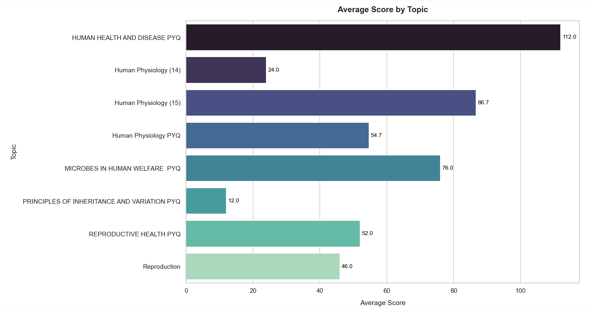

# Personalized Student Recommendations

## Project Overview

The Personalized Student Recommendations project aims to analyze quiz performance data and provide students with personalized recommendations to improve their preparation. By identifying patterns in student performance across topics, difficulty levels, and response accuracy, the system generates insights and actionable steps for students to enhance their learning experience.

## Features

- Analyze student performance across multiple quizzes.
- Generate insights highlighting weak areas and improvement trends.
- Provide personalized recommendations focusing on specific topics, question types, and difficulty levels.
- Define student personas based on performance patterns.

## Setup Instructions

### Prerequisites

Before you begin, ensure you have the following installed:

- Python 3.7 or higher
- pip (Python package installer)
- Virtual environment tool (virtualenv, venv, etc.)

### Installation

1. **Clone the repository:**

   ```sh
   git clone https://github.com/adolui-2002/Personalized-Student-Recommendations.git
   cd Personalized-Student-Recommendations
   ```

2. **Create and activate a virtual environment:**

   - For Windows:

     ```sh
     python -m venv venv
     venv\Scripts\activate
     ```

   - For macOS/Linux:

     ```sh
     python3 -m venv venv
     source venv/bin/activate
     ```

3. **Install the required packages:**

   ```sh
   pip install -r requirements.txt
   ```

4. **Data Preparation:**

   Ensure you have the following data files in the `data` directory:
   - `current_quiz_data.json`: Details of the user’s latest quiz submission.
   - `quiz_submission_data.json`: Quiz submission data (not used directly in the analysis).
   - `historical_quiz_data.json`: Performance data from the last 5 quizzes for each user.

## Running the Project

1. **Navigate to the `src` directory:**

   ```sh
   cd src
   ```

2. **Run the main script:**

   ```sh
   python main.py
   ```

   This will output the visualization, insights, recommendations, and student persona based on the provided data.

## Project Structure

```
Personalized-Student-Recommendations/
│
├── data/
│   ├── current_quiz_data.json
│   ├── quiz_submission_data.json
│   └── historical_quiz_data.json
│
├── src/
│   ├── main.py
│   ├── data_analysis.py
│   ├── insights_generation.py
│   ├── recommendations.py
│   └── visualize.py
│
├── README.md
├── requirements.txt

```

## Approach Description

### Data Analysis (`data_analysis.py`)

- Extracts and analyzes the current and historical quiz data.
- Identifies student performance by topics, difficulty levels, and response accuracy.

### Insights Generation (`insights_generation.py`)

- Generates insights based on the analyzed data.
- Highlights weak areas, improvement trends, and performance gaps.

### Recommendations (`recommendations.py`)

- Provides actionable steps for the student to improve.
- Suggests specific topics, question types, or difficulty levels to focus on.
- Defines the student persona based on performance patterns.

### Visualization (`visualize.py`)

- Creates visualizations to represent the performance data.
- Helps in understanding the insights through graphical representations.

### Main Script (`main.py`)

- Orchestrates the data analysis, insights generation, and recommendations.
- Loads the data, calls the respective modules, and prints the insights and recommendations.

## Example Output

```
Insights:

Weak Topics:
 - Human Physiology (14): Average Score = 24.00
 - PRINCIPLES OF INHERITANCE AND VARIATION PYQ: Average Score = 12.00
 - Reproduction: Average Score = 46.00

Improving Topics:
 - Human Physiology (15): Average Score = 86.67
 - MICROBES IN HUMAN WELFARE PYQ: Average Score = 76.00
 - REPRODUCTIVE HEALTH PYQ: Average Score = 52.00

Recommendations:
Focus on improving your understanding of the following topics:
 - Human Physiology (14) (Average Score: 24.00)
 - PRINCIPLES OF INHERITANCE AND VARIATION PYQ (Average Score: 12.00)
 - Reproduction (Average Score: 46.00)

Student Persona:
Strengths by Topics: ['Human Physiology (15)', 'Human Physiology PYQ', 'HUMAN HEALTH AND DISEASE PYQ']
Strengths by Difficulty Levels: ['Medium', 'Hard']
Weaknesses by Topics: ['Human Physiology PYQ', 'Human Physiology (15)', 'Reproduction', 'PRINCIPLES OF INHERITANCE AND VARIATION PYQ', 'REPRODUCTIVE HEALTH PYQ', 'Human Physiology (14)']
Weaknesses by Difficulty Levels: ['Easy', 'Medium']
```
## Visualization


## Contribution

If you would like to contribute to this project, please fork the repository and submit a pull request. For major changes, please open an issue first to discuss what you would like to change.

